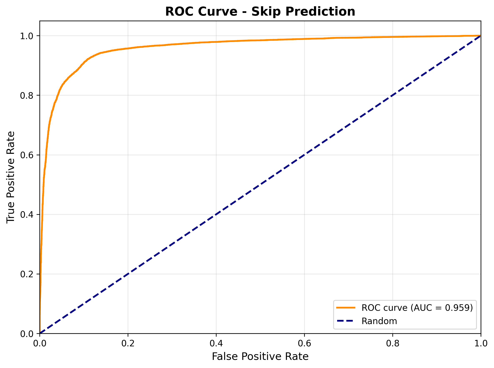
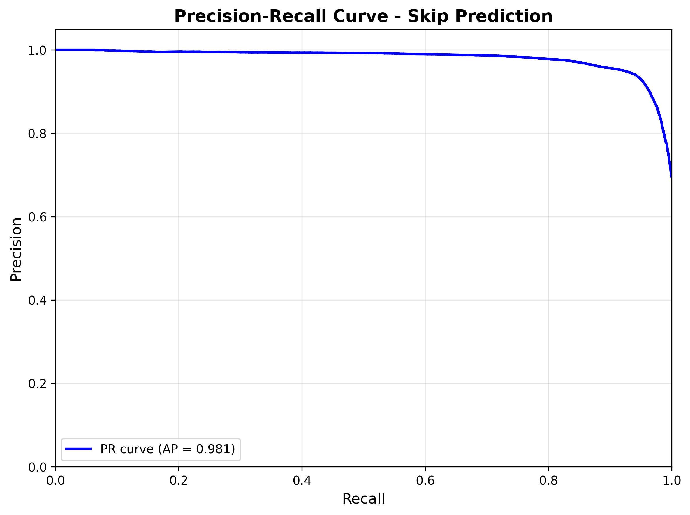
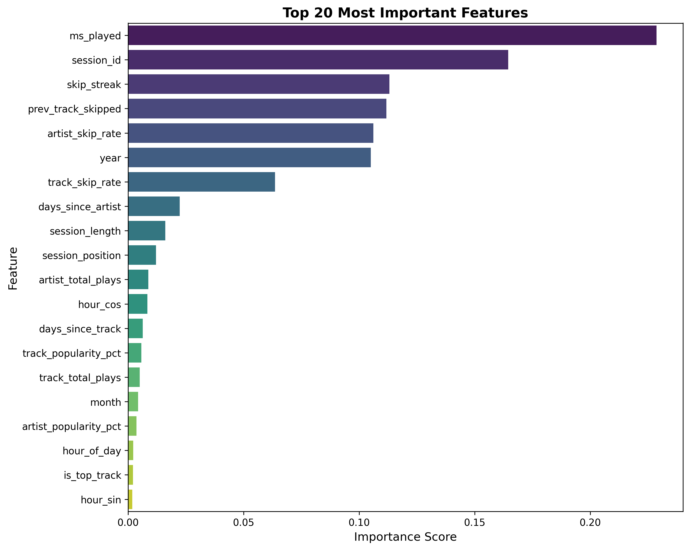
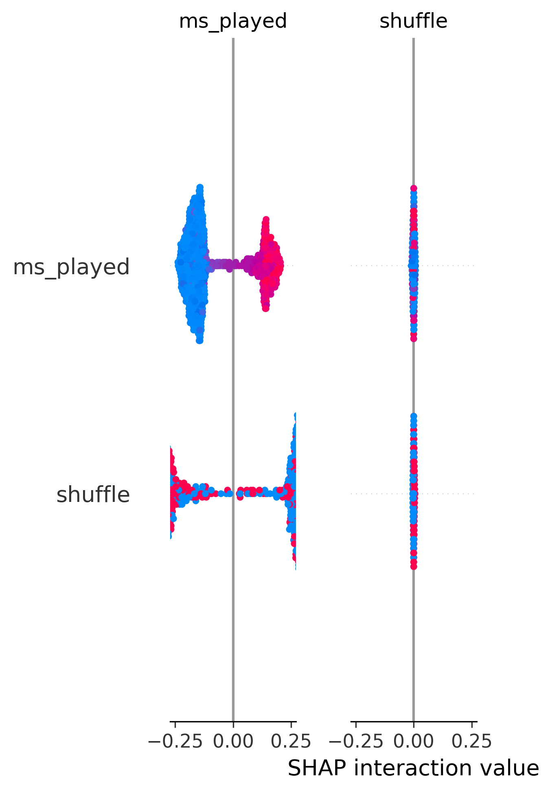
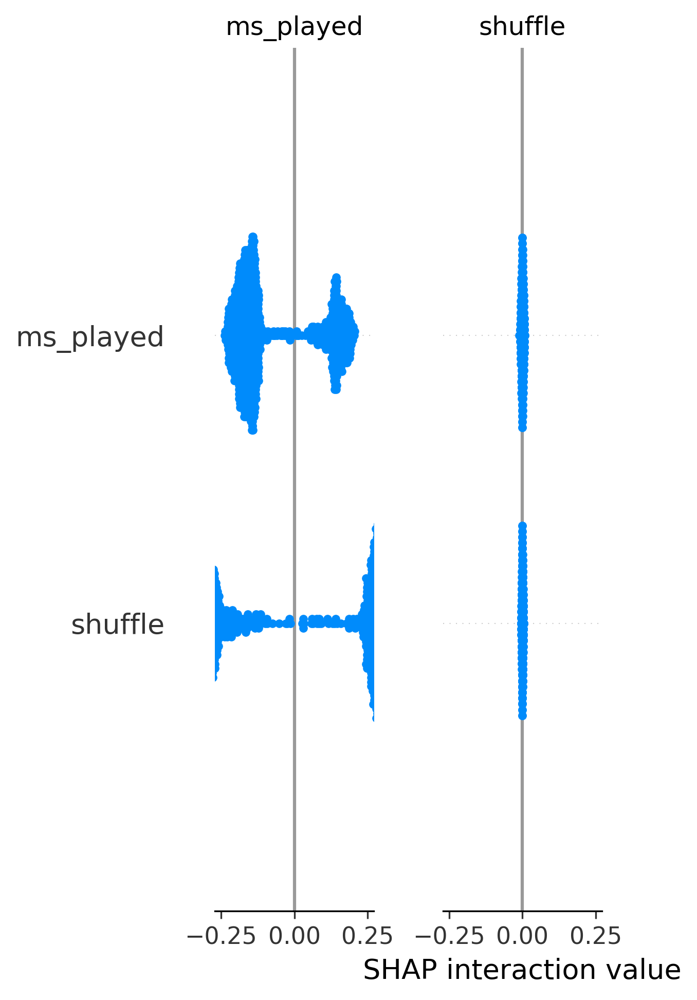
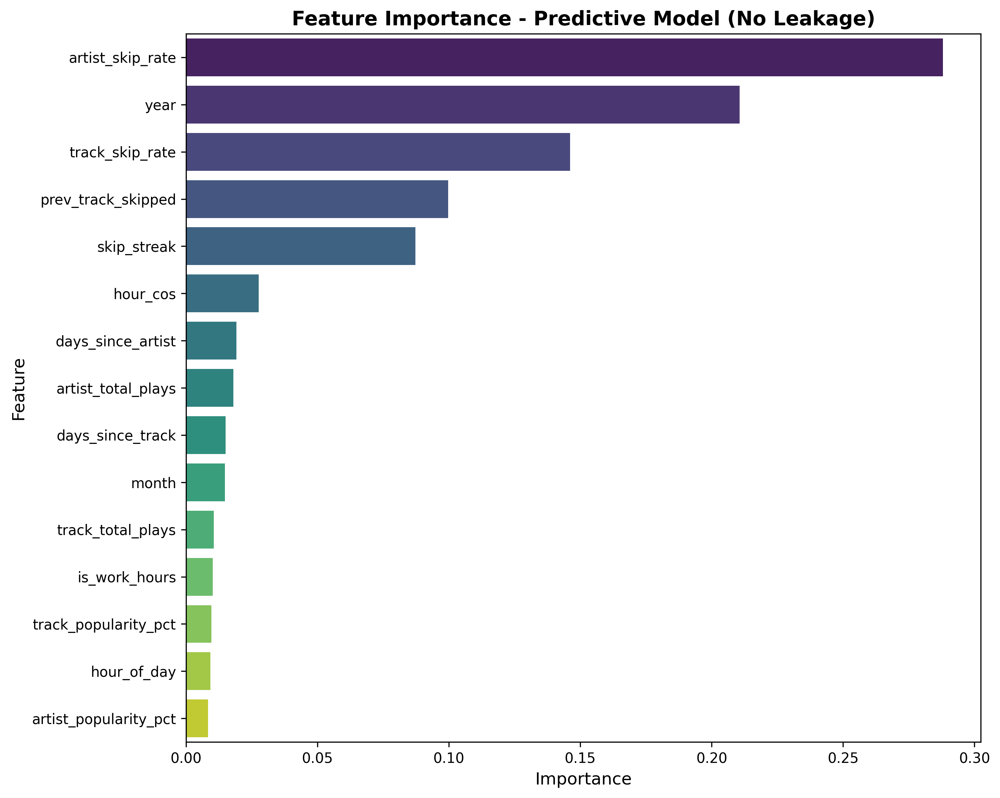

# Spotify Skip Prediction

A machine learning project to predict and explain when songs are skipped on Spotify.

## Project Overview

This project analyzes listening behavior to predict when a user will skip a song and provides interpretable explanations for those predictions.

## Features

- **Data Collection**: Automated collection of listening history via Spotify API
- **Feature Engineering**: Extract audio features, temporal patterns, and listening context
- **Skip Detection**: Infer skips from listening duration vs track length
- **ML Modeling**: XGBoost/Random Forest models for skip prediction
- **Explainability**: SHAP values to understand why songs are skipped

## Project Structure

```
.
├── data/
│   ├── raw/              # Raw data from Spotify API
│   └── processed/        # Cleaned and feature-engineered data
├── notebooks/            # Jupyter notebooks for analysis
├── src/
│   ├── data_collection/  # Scripts to fetch Spotify data
│   ├── features/         # Feature engineering
│   ├── models/           # Model training and evaluation
│   └── visualization/    # Plotting and explainability
├── tests/                # Unit tests
├── config/               # Configuration files
└── requirements.txt      # Python dependencies
```

## Setup

### 1. Install dependencies
```bash
pip install -r requirements.txt
```

### 2. Get your Spotify extended streaming history

1. Go to [Spotify Privacy Settings](https://www.spotify.com/account/privacy/)
2. Scroll to "Download your data" and request your data
3. Wait for email (can take up to 30 days, usually faster)
4. Download and extract the ZIP file
5. Copy the JSON files (named like `endsong_0.json`, `endsong_1.json`, etc.) to:
   ```
   data/raw/spotify_history/
   ```

### 3. Parse your listening history

```bash
cd src/data_collection
python parse_spotify_history.py
```

This will:
- Load all your streaming history JSON files
- Parse track names, artists, timestamps, and listen duration
- Detect skipped tracks (tracks played for <50% duration or <30s)
- Add temporal features (hour, day of week, etc.)
- Save processed data to `data/processed/listening_history_parsed.csv`

### 4. (Optional) Enrich with audio features

To add Spotify's audio features (danceability, energy, etc.), you'll need API access:

1. Create a `.env` file with credentials:
   ```
   SPOTIFY_CLIENT_ID=your_client_id
   SPOTIFY_CLIENT_SECRET=your_client_secret
   ```
2. Run: `python src/data_collection/enrich_with_audio_features.py`

**Note**: Spotify API new app registrations are currently paused. You can still do initial analysis without audio features and add them later.

## Usage

### Parse listening history
```bash
python src/data_collection/parse_spotify_history.py
```

### Train exploratory model
```bash
cd src/models
python train_model.py
```

### Train predictive model (no data leakage)
```bash
cd src/models
python train_predictive_model.py
```

### Train PyTorch neural network
```bash
cd src/models
python train_pytorch_model.py
```

### Train TensorFlow/Keras neural network
```bash
cd src/models
python train_tensorflow_model.py
```

### Compare all models
```bash
cd src/models
python compare_all_models.py
```

### Make predictions
```bash
cd src/models
python predict.py
```

### Generate SHAP explanations
```bash
cd src/models
python explain_model.py
```

### Exploratory analysis
```bash
jupyter notebook notebooks/01_exploratory_analysis.ipynb
```

### Example Predictions

```
======================================================================
SKIP PREDICTIONS FOR RECENT TRACKS
======================================================================

1. Closer - The Chainsmokers
   Prediction: WILL SKIP
   Skip Probability: 67.0%
   Confidence: 33.9%
   Actual: SKIPPED ✓

2. Oklahoma Smokeshow - Zach Bryan
   Prediction: WILL SKIP
   Skip Probability: 84.0%
   Confidence: 68.1%
   Actual: SKIPPED ✓

3. Something in the Orange - Zach Bryan
   Prediction: WILL NOT SKIP
   Skip Probability: 36.6%
   Confidence: 26.8%
   Actual: NOT SKIPPED ✓
```

The model correctly predicts skip behavior based on listening duration, session context, and historical patterns.

## Results

### Multiple Models: Traditional ML vs Deep Learning

This project demonstrates **data leakage awareness** and **model architecture comparison** by training multiple models:

| Model | Type | ROC AUC | Avg Precision | Features | Use Case |
|-------|------|---------|---------------|----------|----------|
| **Random Forest (Predictive)** | Tree-Based | 86.06% | 93.45% | 29 (no leakage) | Prediction before playback |
| **PyTorch Neural Network** | Deep Learning | 83.39% | 92.50% | 29 (no leakage) | Deep learning approach |
| **Random Forest (Exploratory)** | Tree-Based | 95.92% | 98.06% | 33 (includes `ms_played`) | Understanding skip behavior |

<p align="center">
  
</p>

**Key Insights:**
1. **Exploratory model** achieves highest accuracy (95.92% AUC) but uses features like `ms_played` (listening duration) that are only known after playback
2. **Predictive models** (Random Forest: 86.06%, PyTorch: 83.39%) exclude leaky features, making them suitable for prediction before a track is played
3. **Random Forest outperforms PyTorch** on this tabular data, which aligns with research showing tree-based models often excel on structured datasets
4. The 10-point AUC difference demonstrates the trade-off between using all available data vs. avoiding data leakage

See [RESULTS.md](RESULTS.md) for detailed analysis.

### Model Performance Curves

<p align="center">
  
  
</p>

The ROC curve (left) shows excellent discrimination ability with 95.92% AUC. The precision-recall curve (right) demonstrates strong performance on the imbalanced dataset with 98.06% average precision.

### Feature Importance

<p align="center">
  
</p>

**Top 5 Most Important Features:**
1. **ms_played** (22.9%) - Duration listened to the track
2. **session_id** (16.4%) - Listening session context
3. **skip_streak** (11.3%) - Consecutive skip behavior
4. **prev_track_skipped** (11.2%) - Previous track outcome
5. **artist_skip_rate** (10.6%) - Historical artist preference

### Model Explainability with SHAP

<p align="center">
  
</p>

SHAP (SHapley Additive exPlanations) values show how each feature impacts predictions. Red points indicate high feature values pushing toward skip prediction, while blue points show low values pushing toward no-skip.

<p align="center">
  
</p>

Mean absolute SHAP values confirm listening duration (ms_played) and behavioral patterns (skip_streak, prev_track_skipped) are the strongest drivers of skip predictions.

### Exploratory Model - Top Features

1. **ms_played** (22.9%) - Duration listened (leaky)
2. **session_id** (16.4%) - Session context (leaky)
3. **skip_streak** (11.3%) - Consecutive skip behavior
4. **prev_track_skipped** (11.2%) - Previous track outcome
5. **artist_skip_rate** (10.6%) - Historical artist preference

### Predictive Model - Top Features (No Leakage)

<p align="center">
  
</p>

1. **artist_skip_rate** (28.8%) - Historical artist preference
2. **year** (21.1%) - Listening year (captures changing tastes)
3. **track_skip_rate** (14.6%) - Historical track preference
4. **prev_track_skipped** (10.0%) - Previous track outcome
5. **skip_streak** (8.7%) - Consecutive skip behavior

**Key Insight:** Without `ms_played`, the model relies more heavily on **historical skip patterns** and **temporal features**, which are available before playback starts.

## Next Steps

### Spotify API Integration
Once Spotify reopens API registrations, the project can be enhanced with audio features:

**Audio Features to Add:**
- **Acoustic attributes**: danceability, energy, valence, tempo
- **Track metadata**: duration, key, mode, time signature
- **Audio analysis**: loudness, speechiness, instrumentalness

**Implementation Plan:**
1. Create `enrich_with_audio_features.py` to fetch audio features for tracks
2. Retrain models with combined behavioral + audio features
3. Compare performance: behavioral-only vs. behavioral + audio
4. Analyze which audio features correlate with skip behavior

**Expected Benefits:**
- Potential performance improvement (capturing musical preferences)
- Deeper insights into why certain tracks are skipped
- Ability to predict skips for new/unheard tracks based on audio characteristics

### Other Potential Enhancements
- **Cross-validation**: Implement k-fold cross-validation for more robust evaluation
- **Hyperparameter tuning**: Grid search or Bayesian optimization for model parameters
- **Additional models**: LightGBM, CatBoost for comparison
- **Feature interactions**: Polynomial features or learned embeddings
- **Temporal analysis**: How skip patterns change over time
- **Interactive dashboard**: Streamlit or Plotly Dash for visualization
- **A/B testing framework**: Compare different model versions

## Technologies

### Machine Learning & Deep Learning
- **Traditional ML**: scikit-learn, Random Forest, XGBoost
- **Deep Learning**: PyTorch, TensorFlow/Keras
- **Model Explainability**: SHAP (SHapley Additive exPlanations)

### Data Processing & Analysis
- **Data manipulation**: pandas, numpy
- **Visualization**: matplotlib, seaborn, plotly
- **API Integration**: spotipy (Spotify API wrapper)

### Model Architectures
- **Random Forest**: Ensemble of 200 decision trees with class balancing
- **PyTorch NN**: 3-layer architecture (128→64→32) with batch normalization and dropout
- **TensorFlow/Keras**: Configurable deep neural network with L2 regularization
